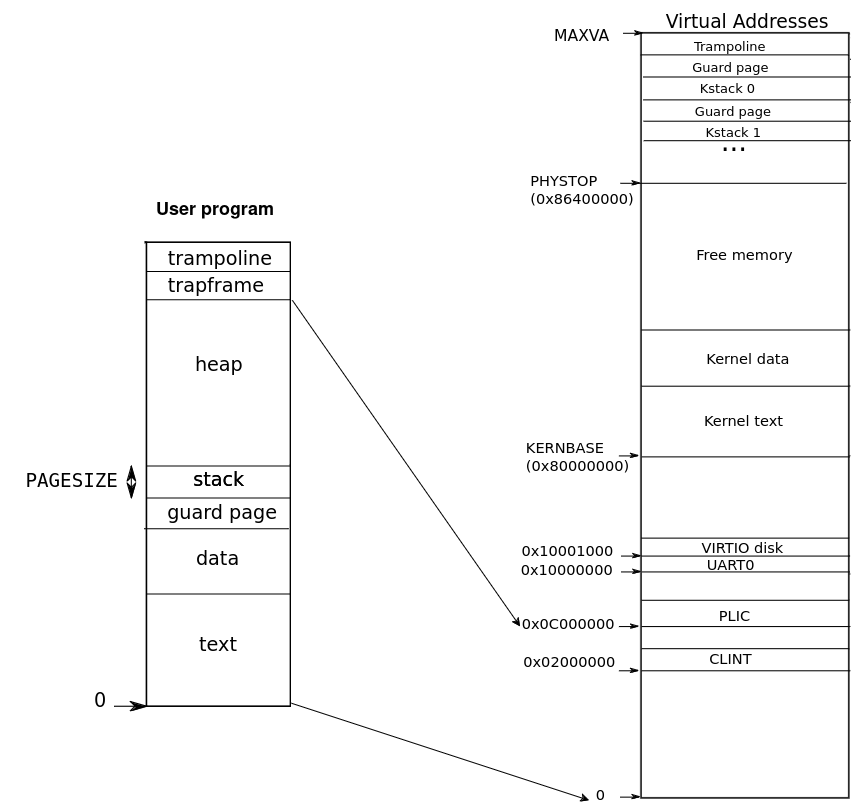

# Lab: page tables
## Print a page table
> Define a function called vmprint(). It should take a pagetable_t argument, and print that pagetable in the format described below. Insert if(p->pid==1) vmprint(p->pagetable) in exec.c just before the return argc, to print the first process's page table. You receive full credit for this assignment if you pass the pte printout test of make grade.

xv6 runs on the Sv39 RISC-V architecture, employing a three-level page table to translate virtual addresses to physical addresses.


A multilevel page table can be considered a tree structure, where we can employ depth-first search (DFS) to traverse all nodes in the tree.

Firstly, define the function prototype in defs.h, then proceed to implement the function in `vm.c`.
```c
// defs.h
void            vmprint(pagetable_t, uint8);
// vm.c
void vmprint(pagetable_t pagetable, uint8 level) {
  for(int i = 0; i < 512; i++){
    pte_t pte = pagetable[i];
    if (pte & PTE_V) {
      // this PTE points to a lower-level page table.
      uint64 child = PTE2PA(pte);
      if (level == 2) {
        printf("..");
      } else if (level == 1) {
        printf(".. ..");
      } else if (level == 0) {
        printf(".. .. ..");
      }
      printf("%d: pte %p pa %p\n", i, pte, child);
      if (level)
        vmprint((pagetable_t) child, level-1);
    }
  }  
}
```
* Check the valid flag to determine if the offset has a page entry
* Utilize the `PTE2PA` macro to shift out all flag bits and obtain the lower-level address

Finally call `vmprint` in `exec.c`
```c
if (p->pid == 1) {
  printf("page table %p\n", pagetable);
  vmprint(p->pagetable, 2);
}
return argc;
```

## A kernel page table per process
> Your first job is to modify the kernel so that every process uses its own copy of the kernel page table when executing in the kernel. Modify struct proc to maintain a kernel page table for each process, and modify the scheduler to switch kernel page tables when switching processes. For this step, each per-process kernel page table should be identical to the existing global kernel page table. You pass this part of the lab if usertests runs correctly. 

According to the instructions, we need to create per-process kernel_pagetable.  

First, let's observe how the kernel_pagetable is created in the original xv6. There are two parts involved, located respectively in function `kvminit` and `procinit`.

```c
void kvminit()
{
  kernel_pagetable = (pagetable_t) kalloc();
  memset(kernel_pagetable, 0, PGSIZE);

  // uart registers
  kvmmap(UART0, UART0, PGSIZE, PTE_R | PTE_W);

  // virtio mmio disk interface
  kvmmap(VIRTIO0, VIRTIO0, PGSIZE, PTE_R | PTE_W);

  // CLINT
  kvmmap(CLINT, CLINT, 0x10000, PTE_R | PTE_W);

  // PLIC
  kvmmap(PLIC, PLIC, 0x400000, PTE_R | PTE_W);

  // map kernel text executable and read-only.
  kvmmap(KERNBASE, KERNBASE, (uint64)etext-KERNBASE, PTE_R | PTE_X);

  // map kernel data and the physical RAM we'll make use of.
  kvmmap((uint64)etext, (uint64)etext, PHYSTOP-(uint64)etext, PTE_R | PTE_W);

  // map the trampoline for trap entry/exit to
  // the highest virtual address in the kernel.
  kvmmap(TRAMPOLINE, (uint64)trampoline, PGSIZE, PTE_R | PTE_X);
}
```
The `kvmmap` function calls `mappages`. `mappages` traverses the page table based on the given virtual address, establishes a page entry, and writes the physical address into the level 0 page entry.  

Next, the mapping of the kernel stack needs to be addressed.
```c
void procinit(void)
{
  struct proc *p;
  
  initlock(&pid_lock, "nextpid");
  for(p = proc; p < &proc[NPROC]; p++) {
      initlock(&p->lock, "proc");

      // Allocate a page for the process's kernel stack.
      // Map it high in memory, followed by an invalid
      // guard page.
      char *pa = kalloc();
      if(pa == 0)
        panic("kalloc");
      uint64 va = KSTACK((int) (p - proc));
      kvmmap(va, (uint64)pa, PGSIZE, PTE_R | PTE_W);
      p->kstack = va;
  }
  kvminithart();
}
```
In xv6, the maximum number of processes is 64. When a process switches to kernel mode, it requires the use of a kernel stack. These stacks are created once and mapped in the kernel page table. The virtual addresses of kernel stacks start after `0x86400000`, with a total of 64 stacks. Each stack is accompanied by a guard page used to detect stack overflow. The guard page is not mapped in the page table, so when the stack pointer exceeds the stack's range, a page fault occurs due to encountering an unmapped address.

Having understood the method of creating the kernel page table, the next step is to mimic these two functions to create a page table for each process.  

```c
// An empty user page table.
p->pagetable = proc_pagetable(p);
if(p->pagetable == 0){
  freeproc(p);
  release(&p->lock);
  return 0;
}

p->kernel_pagetable = proc_kernel_pagetable(p);
if (p->kernel_pagetable == 0) {
  freeproc(p);
  release(&p->lock);
  return 0;
}

for(struct proc *pp = proc; pp < &proc[NPROC]; pp++) {
  // Map kernel stack to virtual address created in procinit.
  // Calculate virtual address for kernel stack, incrementing by 8192 on each iteration
  uint64 va = KSTACK((int) (pp - proc));
  if (mappages(p->kernel_pagetable, va, PGSIZE, kvmpa(pp->kstack), PTE_R | PTE_W) != 0) {
    freeproc(p);
    release(&p->lock);
    return 0;
  }
}

// Set up new context to start executing at forkret,
// which returns to user space.
memset(&p->context, 0, sizeof(p->context));
p->context.ra = (uint64)forkret;
p->context.sp = p->kstack + PGSIZE;
```
In the `allocproc` function, we create a kernel page table for each process. One notable difference is in the mapping of the kernel stack compared to its original implementation in `procinit`. In `procinit`, the virtual address `kstack` is assigned to each process. Therefore, when used later, we need to obtain the physical address of `kstack`. This ensures that the mapping information for the process's kernel page table matches that of the global kernel page table. Otherwise, unexpected behavior may occur when switching page tables.  

```c
pagetable_t proc_kernel_pagetable(struct proc *p)
{
  pagetable_t pagetable;

  // An empty page table.
  pagetable = uvmcreate();
  if(pagetable == 0)
    return 0;
  
  if (mappages(pagetable, UART0, PGSIZE, UART0, PTE_R | PTE_W) != 0)
    goto bad;
  if (mappages(pagetable, VIRTIO0, PGSIZE, VIRTIO0, PTE_R | PTE_W) != 0)
    goto bad;
  if (mappages(pagetable, PLIC, 0x400000, PLIC, PTE_R | PTE_W) != 0)
    goto bad;
  if (mappages(pagetable, KERNBASE, (uint64)etext-KERNBASE, KERNBASE, PTE_R | PTE_X) != 0)
    goto bad;
  if (mappages(pagetable, (uint64)etext, PHYSTOP-(uint64)etext, (uint64)etext, PTE_R | PTE_W) != 0)
    goto bad;
  if (mappages(pagetable, TRAMPOLINE, PGSIZE, (uint64)trampoline, PTE_R | PTE_X) != 0)
    goto bad;
  
  return pagetable;

  bad:
    proc_freekernel_pagetable(pagetable);
    return 0;
}
```
Similar to the mapping method in `kvminit`, here, if `mappages` fails to complete the mapping successfully, we release the allocated memory and return 0. This indicates that there is currently not enough memory to create a process.

```c
// proc.c
// Free a process's kernel pagetable, don't free the memory
// of kernel relative address
void proc_freekernel_pagetable(pagetable_t pagetable) {
  uvmfree(pagetable, 0);
}
// vm.c
void uvmfree(pagetable_t pagetable, uint64 sz)
{
  if(sz > 0)
    uvmunmap(pagetable, 0, PGROUNDUP(sz)/PGSIZE, 1);
  freewalk(pagetable);
}
void freewalk(pagetable_t pagetable)
{
  // there are 2^9 = 512 PTEs in a page table.
  for(int i = 0; i < 512; i++){
    pte_t pte = pagetable[i];
    if((pte & PTE_V) && (pte & (PTE_R|PTE_W|PTE_X)) == 0){
      // this PTE points to a lower-level page table.
      uint64 child = PTE2PA(pte);
      freewalk((pagetable_t)child);
      pagetable[i] = 0;
    } else if(pte & PTE_V){
      //panic("freewalk: leaf");
    }
  }
  kfree((void*)pagetable);
}
```
We also need a method to release the kernel page table of a process. It's important to note that we should only free the page table itself, without free the physical addresses corresponding to the level 0 page entries. Doing so could disrupt the functioning of the kernel. We have modified `freewalk` to handle panics generated by leaf nodes, allowing the kernel page table to release page tables without affecting physical addresses. (This modification does not affect the original functionality of functions using `freewalk`.)  
* Also call `proc_freekernel_pagetable` in `freeproc`
    ```c
    if (p->kernel_pagetable) {
        proc_freekernel_pagetable(p->kernel_pagetable);
    }
    p->kernel_pagetable = 0;
    ```

With the completion of the creation and release of kernel page tables, the final step is to modify the `scheduler` to enable the switching of per-process kernel page tables and the global process page table.
```c
// proc.c
p->state = RUNNING;
c->proc = p;
w_satp(MAKE_SATP(p->kernel_pagetable));
sfence_vma();
swtch(&c->context, &p->context);
kvminithart();
```
## Simplify <tt>copyin/copyinstr</tt>
> Replace the body of copyin in kernel/vm.c with a call to copyin_new (defined in kernel/vmcopyin.c); do the same for copyinstr and copyinstr_new. Add mappings for user addresses to each process's kernel page table so that copyin_new and copyinstr_new work. You pass this assignment if usertests runs correctly and all the make grade tests pass. 

The task requires speeding up access to user addresses in kernel mode by adding mappings for user addresses in the process's kernel page table.  



We can utilize memory addresses below the PLIC to map user programs since executing user programs doesn't require CLINT. Hence, we can use this memory region for mapping as well.  

In the following functions, which involve modifying the page table, we need to make modifications to synchronize the mappings(under PLIC) of user programs between the two page tables.
* `kernel/vm.c`
  * `uvninit`
  * `uvmalloc`
  * `uvmdealloc`
  * `uvmcopy`
* `kernel/proc.c`
  * `userinit`
  * `fork`
  * `growproc`
* `kernel/exec.c`
  * `exec`

Let's start by modifying the prototypes in `defs.h` for the three functions in `vm.c`.
```c
void            uvminit(pagetable_t, pagetable_t,uchar *, uint);
uint64          uvmalloc(pagetable_t, pagetable_t, uint64, uint64);
uint64          uvmdealloc(pagetable_t, pagetable_t, uint64, uint64);
#ifdef SOL_COW
#else
int             uvmcopy(pagetable_t, pagetable_t, pagetable_t, uint64);
#endif
```  
The modifications for these four functions are similar. When these functions call `mappages`, they also add mappings to the newly added page table.
```c
void uvminit(pagetable_t pagetable, pagetable_t kernel_pagetable, uchar *src, uint sz)
{
  char *mem;

  if(sz >= PGSIZE)
    panic("inituvm: more than a page");
  mem = kalloc();
  memset(mem, 0, PGSIZE);
  mappages(pagetable, 0, PGSIZE, (uint64)mem, PTE_W|PTE_R|PTE_X|PTE_U);
  mappages(kernel_pagetable, 0, PGSIZE, (uint64)mem, PTE_W|PTE_R|PTE_X);
  memmove(mem, src, sz);
}

uint64 uvmalloc(pagetable_t pagetable, pagetable_t kernel_pagetable, uint64 oldsz, uint64 newsz)
{
  char *mem;
  uint64 a;

  if(newsz < oldsz)
    return oldsz;

  oldsz = PGROUNDUP(oldsz);
  for(a = oldsz; a < newsz; a += PGSIZE){
    mem = kalloc();
    if(mem == 0){
      uvmdealloc(pagetable, kernel_pagetable, a, oldsz);
      return 0;
    }
    memset(mem, 0, PGSIZE);
    if(mappages(pagetable, a, PGSIZE, (uint64)mem, PTE_W|PTE_X|PTE_R|PTE_U) != 0 || 
       mappages(kernel_pagetable, a, PGSIZE, (uint64)mem, PTE_W|PTE_X|PTE_R) != 0){
      kfree(mem);
      uvmdealloc(pagetable, kernel_pagetable, a, oldsz);
      return 0;
    }
  }
  return newsz;
}

uint64 uvmdealloc(pagetable_t pagetable, pagetable_t kernel_pagetable, uint64 oldsz, uint64 newsz)
{
  if(newsz >= oldsz)
    return oldsz;

  if(PGROUNDUP(newsz) < PGROUNDUP(oldsz)){
    int npages = (PGROUNDUP(oldsz) - PGROUNDUP(newsz)) / PGSIZE;
    uvmunmap(pagetable, PGROUNDUP(newsz), npages, 1);
    uvmunmap(kernel_pagetable, PGROUNDUP(newsz), npages, 0);
  }

  return newsz;
}

int uvmcopy(pagetable_t old, pagetable_t new, pagetable_t _new, uint64 sz)
{
  pte_t *pte;
  uint64 pa, i;
  uint flags;
  char *mem;

  for(i = 0; i < sz; i += PGSIZE){
    if((pte = walk(old, i, 0)) == 0)
      panic("uvmcopy: pte should exist");
    if((*pte & PTE_V) == 0)
      panic("uvmcopy: page not present");
    pa = PTE2PA(*pte);
    flags = PTE_FLAGS(*pte);
    if((mem = kalloc()) == 0)
      goto err;
    memmove(mem, (char*)pa, PGSIZE);
    if(mappages(new, i, PGSIZE, (uint64)mem, flags) != 0 || mappages(_new, i, PGSIZE, (uint64)mem, flags & ~PTE_U) != 0){
      kfree(mem);
      goto err;
    }
  }
  return 0;

 err:
  uvmunmap(new, 0, i / PGSIZE, 1);
  uvmunmap(_new, 0, i / PGSIZE, 0);
  return -1;
}
```
* Don't set the `PTE_U` flag in the kernel page table, as doing so will prevent access to this address in kernel mode
* Be mindful that the last parameter of `uvmunmap` determines whether to `free` the physical address. Ensure not to `free` it redundantly


In `userinit`, use the updated version of `uvminit`.
```c
void userinit(void)
{
  ...
  uvminit(p->pagetable, p->kernel_pagetable, initcode, sizeof(initcode));
  p->sz = PGSIZE;
  ...
}
```

In `fork`, use the updated version of `uvmcopy`.
```c
int fork(void)
{
  ...
  // Copy user memory from parent to child.
  if(uvmcopy(p->pagetable, np->pagetable, np->kernel_pagetable, p->sz) < 0){
    freeproc(np);
    release(&np->lock);
    return -1;
  }
  np->sz = p->sz;
  ...
}
```

In `growproc`, use the updated version of `uvmalloc` and `uvmdealloc`.
```c
int growproc(int n)
{
  uint sz;
  struct proc *p = myproc();

  sz = p->sz;
  if(n > 0){
    if(sz + n >= PLIC || (sz = uvmalloc(p->pagetable,p->kernel_pagetable, sz, sz + n)) == 0) {
      return -1;
    }
  } else if(n < 0){
    sz = uvmdealloc(p->pagetable,p->kernel_pagetable, sz, sz + n);
  }
  p->sz = sz;
  return 0;
}
```
* To prevent a process from growing beyond the `PLIC`, an additional constraint has been added to determine whether the process can continue to grow

The modifications to `exec` are more complex, involving not only mappings but also the switching of page tables.  
```c
int exec(char *path, char **argv)
{
  ...
  pagetable_t pagetable = 0, oldpagetable;
  pagetable_t kernel_pagetable = 0, oldkernel_pagetable;
  struct proc *p = myproc();
  ...
  if((pagetable = proc_pagetable(p)) == 0)
    goto bad;
  if ((kernel_pagetable = proc_kernel_pagetable(p)) == 0)
    goto bad;
  ...
  // Load program into memory.
  for(i=0, off=elf.phoff; i<elf.phnum; i++, off+=sizeof(ph)){
    ...
    if((sz1 = uvmalloc(pagetable, kernel_pagetable, sz, ph.vaddr + ph.memsz)) == 0)
      goto bad;
    ...
  }
  ...
  sz = PGROUNDUP(sz);
  uint64 sz1;
  if((sz1 = uvmalloc(pagetable, kernel_pagetable, sz, sz + 2*PGSIZE)) == 0)
    goto bad;
  sz = sz1;
  uvmclear(pagetable, sz-2*PGSIZE);
  sp = sz;
  stackbase = sp - PGSIZE;
  // Map kernel stack
  extern struct proc proc[];
  for(struct proc *pp = proc; pp < &proc[NPROC]; pp++) {
      // Map kernel stack to virtual address created in procinit.
      // Calculate virtual address for kernel stack, incrementing by 8192 on each iteration
      uint64 va = KSTACK((int) (pp - proc));
      if (mappages(kernel_pagetable, va, PGSIZE, kvmpa(pp->kstack), PTE_R | PTE_W) != 0) {
        goto bad;
      }
  }
  ...
  // Commit to the user image.
  oldpagetable = p->pagetable;
  oldkernel_pagetable = p->kernel_pagetable;
  p->pagetable = pagetable;
  p->kernel_pagetable = kernel_pagetable;
  p->sz = sz;
  p->trapframe->epc = elf.entry;  // initial program counter = main
  p->trapframe->sp = sp; // initial stack pointer
  proc_freepagetable(oldpagetable, oldsz);

  w_satp(MAKE_SATP(p->kernel_pagetable));
  sfence_vma();
  proc_freekernel_pagetable(oldkernel_pagetable);

  ...

  bad:
    if(pagetable)
      proc_freepagetable(pagetable, sz);
    if (kernel_pagetable)
      proc_freekernel_pagetable(kernel_pagetable);
  ...
}
```

* In `exec`, the function reads the object file from the file system and loads the program into the memory of the process
* At this stage, the newly created kernel page table also needs to include mappings for the kernel stack
* Before free the oldkernel_pagetable, make sure to switch to the new kernel page table

## Grade
```sh
$ make grade
```

